# Hive Fitness

![Hive Fitness website shown on a variety of screen sizes] (documentation/indexherovideo.png)

The deployed site can be visited here: [Hive Fitness](https://maarkwilliams.github.io/HiveFitness/)

Take a look at our Gym's and get ready to work out!

As of 2023, there are over 7,000 gyms in the UK, with approximately 10 million members. The fitness industry has been growing steadily, and gyms are becoming more diverse, offering a wide range of services from traditional weight training to boutique fitness classes, group workouts, and wellness facilities.

## CONTENTS

* [User Experience](#user-experience-ux)
  * [User Stories](#user-stories)

* [Design](#design)
  * [Colour Scheme](#colour-scheme)
  * [Typography](#typography)
  * [Imagery](#imagery)
  * [Wireframes](#wireframes)
  * [Features](#features)
    * [The Home Page](#the-home-page)
    * [The Clubs Page](#the-clubs-page)
    * [The Members Benefits Page](#the-members-benefits-page)
    * [The Contact Us Page](#the-contact-us-page)
    * [The Success Page](#the-success-page)
    * [The 404 Error Page](#the-404-error-page)
    * [Future Implementations](#future-implementations)
  * [Accessibility](#accessibility)

* [Technologies Used](#technologies-used)
  * [Languages Used](#languages-used)
  * [Frameworks, Libraries & Programs Used](#frameworks-libraries--programs-used)

* [Deployment & Local Development](#deployment--local-development)
  * [Deployment](#deployment)
  * [Local Development](#local-development)
    * [How to Fork](#how-to-fork)
    * [How to Clone](#how-to-clone)

* [Testing](#testing)
  * [Solved Bugs](#solved-bugs)
  * [Known Bugs](#known-bugs)
  
* [Credits](#credits)
  * [Code Used](#code-used)
  * [Content](#content)
  * [Media](#media)
  * [Acknowledgments](#acknowledgments)

- - -
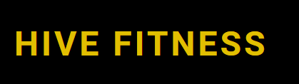  

## User Experience (UX)

### User Stories

#### First Time Visitor Goals
* I want to be able to find out information on the gym.
* I want the site to be optimized for my device.
* I want the site to be user-friendly and easy to navigate.

#### Returning Visitor Goals
* I want to be able to ask questions and provide feedback easily.

---

## Design

### Colour Scheme

I wanted tokeep the colour scheme for the site quite simple. My website features a black background with both saffron and white text. The idea behind this was to keep the website from being overwhelming but still elegant. 

* I have used #000000 for my background. 
* I have used #FFFFFF for text and some text backgrounds.
* I have used #E1BF01 for text and some text backgrounds.

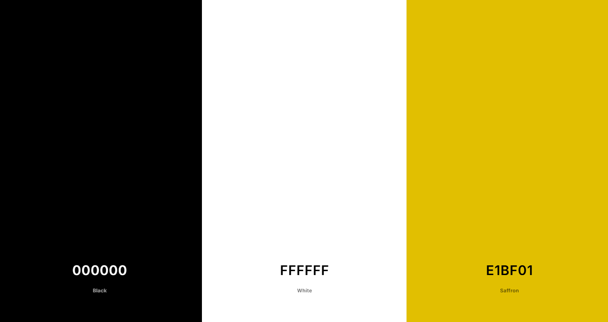

### Typography

Google Fonts was used to import the selected fonts for the site.

* For the headings, I have used the Google font [Roboto](https://fonts.google.com/specimen/Roboto?preview.text=Hive%20Fitness%20HIVE%20FITNESS%20-%20Roboto&preview.text_type=custom&query=roboto). While some grotesks distort their letterforms to force a rigid rhythm, Roboto doesn’t compromise, allowing letters to be settled into their natural width. This makes for a more natural reading rhythm more commonly found in humanist and serif types.

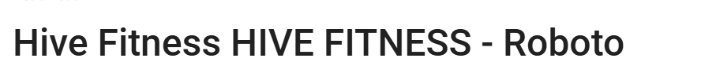

* For the body, I have used Google font [Quicksand](https://fonts.google.com/specimen/Quicksand?preview.text=Hive%20Fitness%20HIVE%20FITNESS%20-%20Quicksand&preview.text_type=custom). QuickSand is a sans-serif font with clean, smooth lines. I’ve chosen a sans-serif font for the body text because studies show that sans-serif fonts tend to be more legible and easier to read on screens.

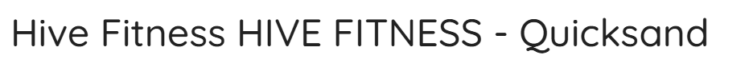

### Imagery

All images on the site were from [Pexels](https://www.pexels.com/)

### Wireframes

Wireframes were created for mobile, tablet and desktop using balsamiq.

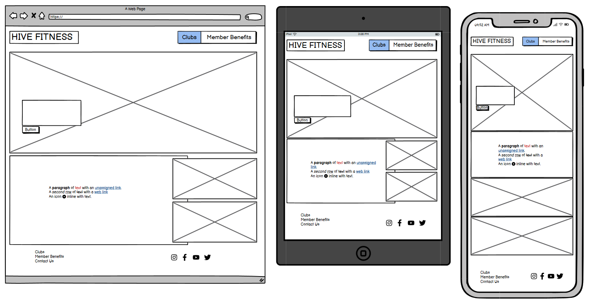
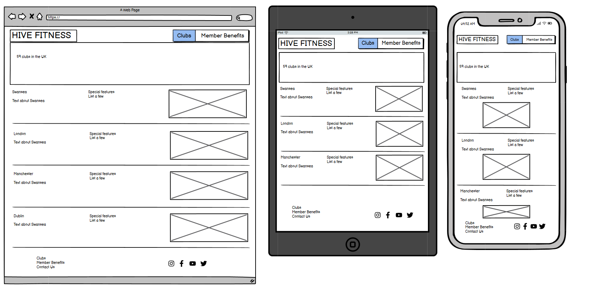
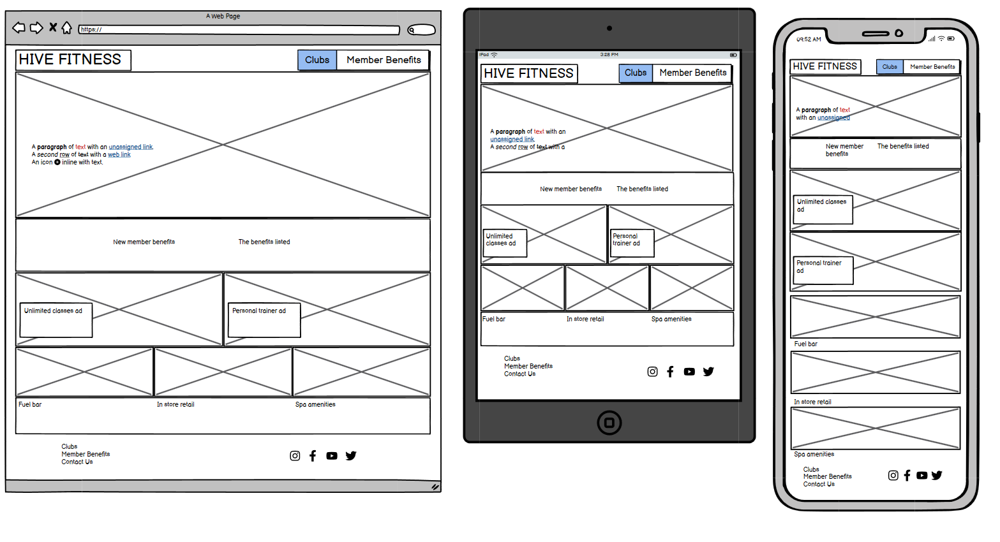
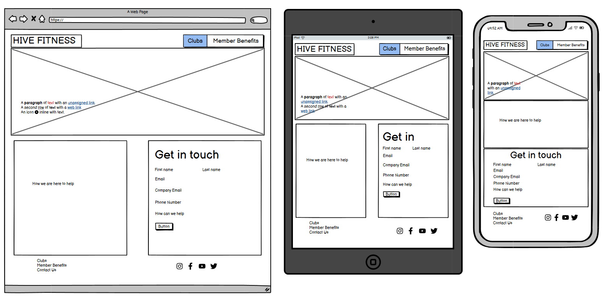

### Features

The website is made up of a home page, a clubs page, a members benefits page, a contact us page, a success page and a 4040 error page.

All page are responsive and have the below:

* A favicon in the browser tab.

* The title/logo of the website on everypage. This also acts as a way to navigate back to the home page.

* Every page has a navigation bar in the header and footer. 

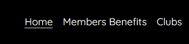
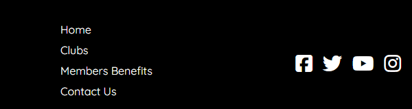

#### The Home Page

The home page of Hive Fitness displays a video of members working out at the gyms which would likely entice people to want to explore more of the website. 

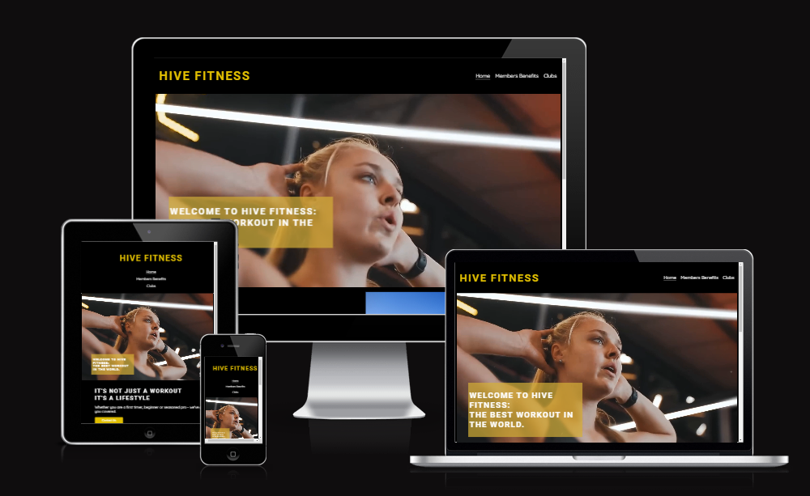

As you scroll down the page, there is a motivational quote, two images to show off the gym and a contact us button which allows the user to seemlessly naviagte to the contact us page to get in touch.

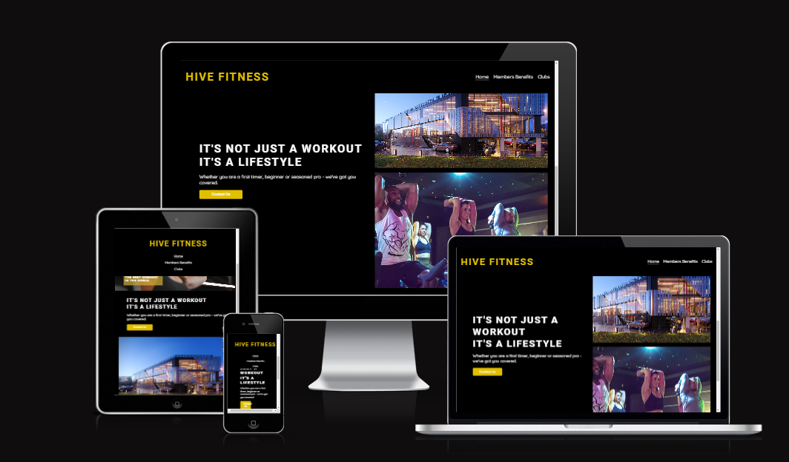

#### The Clubs Page

The clubs page displays in large text the amount of Hive Fitness gyms there are in the UK. The large text is symbolises that Hive is not a small business. 

Below that, there is a brief description and images of the largest cities that Hive Fitness has gyms in.

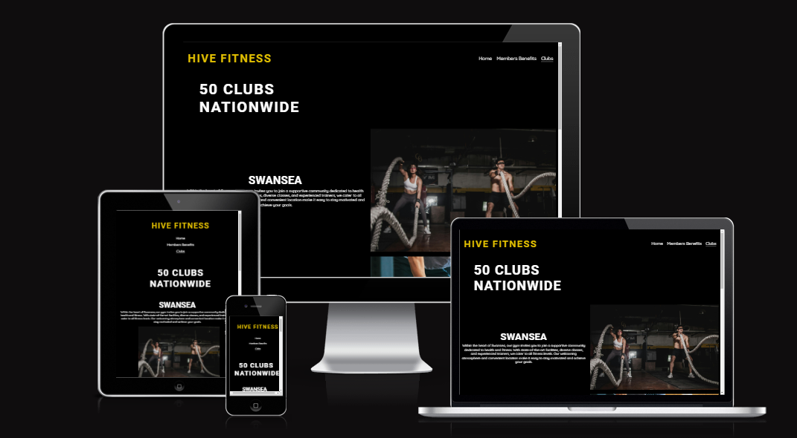

#### The Members Benefits Page

The members page displays a hero image followed by a list of benefits each member would recieve if they were to join Hive Fitness. 

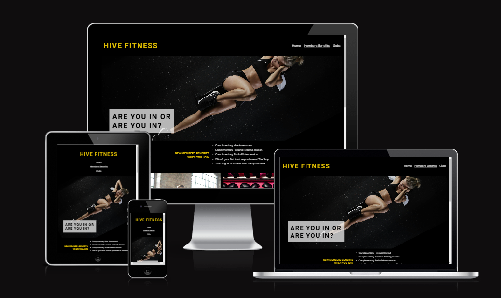

The members page also displays all the amenities that Hive Fitness offer. The classes and personal training is highlighted first with larger images. That is followed by 3 smaller images highlighting the fuel bar, retail store and spa, all with brief desciptions.

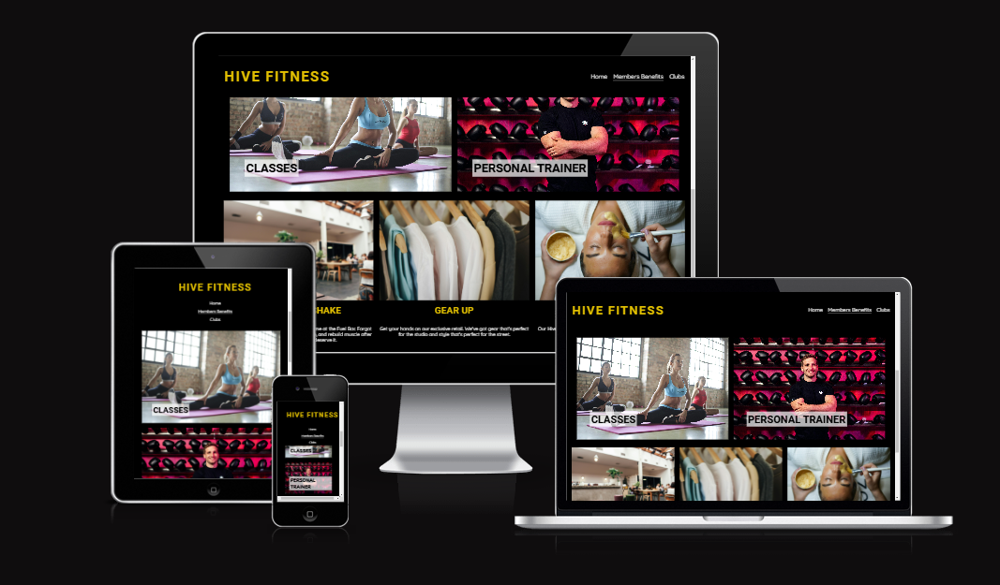

#### The Contact Us Page

The contact us page is where the user is able to engage with the most site the most. This page is used for the user to get in touch or leave feedback. The page contains text encourageing people to use the form on the page. The form has first name, last name, email, phone number, subject and message fields. All field are required to be filled with some form of text. The email field needs to be in email format with an '@'. The submit button below the form, submits the users information and navigates to the success page. 

! [The contact us page](documentation/contactpage.png)

#### The Success Page

The success page displays text indicating the information they submitted via the contact us form was successfully submitted. 

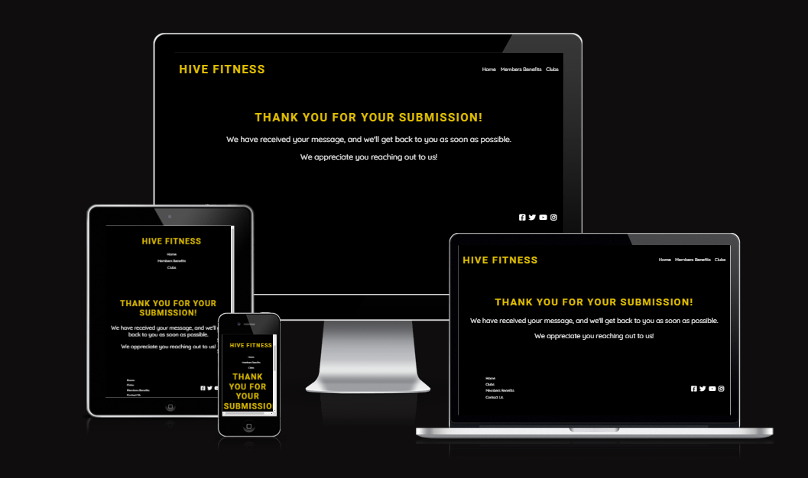

#### The 404 Error Page

The 404 error page displays text informing the user that there has been an error. Even though the user is unable to navigate to the page they want, the custom error page will improve their customer experience. 

 ******

#### Future Implementations

In the future, I would like to implement: 

1. Allow users to be able to purchase membership from the site.
2. A log in page to user to book personal training, classes and the gyms amenities. 
3. Create a back end database which will allow users to access workout routines and meal plans.
4. Explore ways to improve accessibility for people with color blindness.

### Accessibility

I have made a conscious effort during the coding process to ensure the website is highly accessible. I have achieved this by:

* I have used semantic HTML to improve acessibility and make the code more readable.
* I’ve implemented a hover state on all buttons to clearly indicate when a user is hovering over them.
* Choosing fonts that are easily readable and are suitable for dyslexia.
* Ensuring that the colours on the site do not clash, to improve user experience. 

- - -

## Technologies Used

### Languages Used

Html, CSS

### Frameworks, Libraries & Programs Used

* [Balsamiq](https://balsamiq.com/) - To create wireframes.

* [Git](https://git-scm.com/) - For version control.

* [Github](https://github.com/) - To save and store the files for the website.

* [GitPod](https://gitpod.io/) - IDE used to create the site.

* [Google Fonts](https://fonts.google.com/) - To import the fonts used on the website.

* [Google Developer Tools](https://developers.google.com/web/tools) - To troubleshoot and test features, solve issues with responsiveness and styling.

* [Favicon.io](https://favicon.io/) To create favicons.

* [Am I Responsive?](http://ami.responsivedesign.is/) To show the website image on a range of devices.

- - -

## Deployment & Local Development

### Deployment

The site is deployed using GitHub Pages - [Hive Fitness](link here).

To Deploy the site using GitHub Pages:

1. Login (or signup) to Github.
2. Go to the repository for this project, [maarkwilliams/HiveFitness](https://maarkwilliams.github.io/HiveFitness/).
3. Click the settings button.
4. Select pages in the left hand navigation menu.
5. From the source dropdown select main branch and press save.
6. The site has now been deployed, please note that this process may take a few minutes before the site goes live.

### Local Development

#### How to Fork

To fork the repository:

1. Log in (or sign up) to Github.
2. Go to the repository for this project, [maarkwilliams/HiveFitness](https://maarkwilliams.github.io/HiveFitness/)
3. Click the Fork button in the top right corner.

#### How to Clone

To clone the repository:

1. Log in (or sign up) to GitHub.
2. Go to the repository for this project, [maarkwilliams/HiveFitness](https://maarkwilliams.github.io/HiveFitness/)
3. Click on the code button, select whether you would like to clone with HTTPS, SSH or GitHub CLI and copy the link shown.
4. Open the terminal in your code editor and change the current working directory to the location you want to use for the cloned directory.
5. Type 'git clone' into the terminal and then paste the link you copied in step 3. Press enter.

- - -

## Testing

Please refer to [testing.md](testing.md) file for all testing carried out.

### Solved Bugs

| No | Bug | How I solved the issue |
| :--- | :--- | :--- |
| 1 | Contact form button was getting a 501 error when being pressed | :--- |
| 2 | Contact form fields were being allowed to be left blank when submitting | :--- |
| 3 | When fixing my header to the site, It was covering a lot of the hero images/videos | :--- |
| 4 | The social media icons in the footer would not move to the far right of the page | :--- |

### Known Bugs

No known bugs remain on the site.

- - -

## Credits

### Code Used

I used [this youtube channel](https://www.youtube.com/@slayingthedragon/videos) to learn more about flexbox.

I spent hours reading through [this documentation](https://developer.mozilla.org/en-US/docs/Web/CSS) to get a better understanding of css and its capabilities. 

I used [W3 schools html tutorial](https://www.w3schools.com/html/html_intro.asp) to research different approaches I could take when writing the html code for the site.  

### Content

All content for the site was written by myself.

### Media

The hero video for the home page is from [Synergy Film](https://www.youtube.com/watch?v=7gH0H4aunJU)

All other images are from [Pexels](https://www.pexels.com/)

### Acknowledgments

I would like to acknowledge the following people:

* Jubril Akolade - My Code Institute Mentor.

* Marko Tot - My Code Institute Tutor.

* Chris Williams - For taking time out to hear me moan, helping debug and testing the site. 

* The Code Institute Slack channel Peer Code Review 