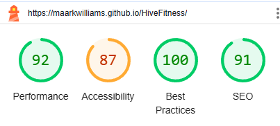
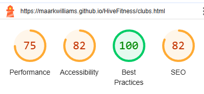
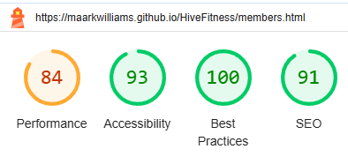
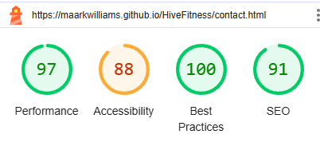
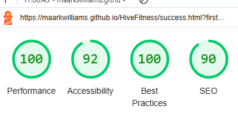
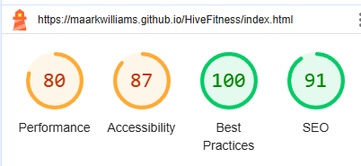
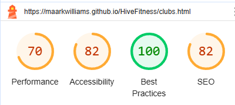
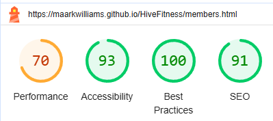
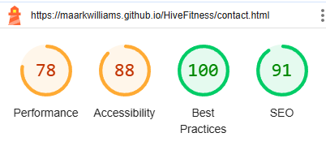
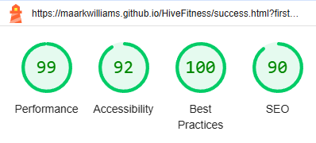

# Hive Fitness - Testing

Visit the deployed site here: [Hive Fitness](https://maarkwilliams.github.io/HiveFitness/)

- - -

## CONTENTS

* [AUTOMATED TESTING](#automated-testing)
  * [W3C Validator](#w3c-validator)
  * [Lighthouse](#lighthouse)
* [MANUAL TESTING](#manual-testing)
  * [Testing User Stories](#testing-user-stories)
  * [Full Testing](#full-testing)

 Testing was continuous throughout the entire development process. I used Chrome Developer Tools to monitor progress, identify issues, and troubleshoot as needed. Additionally, Google Developer Tools were instrumental in ensuring everything functioned as expected and resolving any problems that arose.

 I reviewed each page using Google Chrome Developer Tools and Firefox Inspector to ensure responsiveness across various screen sizes and devices.

- - -

## AUTOMATED TESTING

### W3C Validator

[W3C](https://validator.w3.org/) was used to validate the HTML and CSS on all pages of the website.

* [index.html](testing/w3-index.png) - Passed.
* [clubs.html](testing/w3-clubs.png) - Passed.
* [members.html](testing/w3-members.png) - Passed.
* [contact.html](testing/w3-contact.png) - Passed.
* [success.html](testing/w3-success.png) - Passed.
* [404.html](testing/w3-404.png) - Passed.

* [style.css](testing/w3-css.png) - Passed.

- - -

### Lighthouse

I used Lighthouse in Chrome Developer Tools to evaluate the website's performance, accessibility, best practices, and SEO.

### Desktop Results

### Mobile Results

- - -

`First Time Visitors`

| Goals | How are they achieved? |
| :--- | :--- |
| I want to be able to find out information on the gym. | The site is loaded with information about the gyms and is always available to the user.
| want the site to be optimized for my device. | I designed the site with responsiveness as a key priority.
| I want the site to be user-friendly and easy to navigate. | The site has a navigation bar, footer and buttons throughout the site making it easy for the user to navigate to the page they are looking for. I have also used colour which contrast so the site stands out to the user. 

`Returning Visitors`

|  Goals | How are they achieved? |
| :--- | :--- |
| I want to be able to ask questions and provide feedback easily. | The site has a contact page with a form that allows the user to tell hive Fitness what is on their mind. 

- - -

### Full Testing

Full testing was performed on the following devices:

* Desktop:
  * 34 inch ultrawide & 24 inch 4k monitors
* Laptop:
  * Macbook Pro 2023 14 inch screen
* Tablet Devices:
  * iPhone Pro 12.9 inch.
* Mobile Devices:
  * iPhone 12 Pro Max.

Each device tested the site using the following browsers:

* Google Chrome
* Firefox

Additional testing was conducted by friends and family across various devices and screen sizes, and they reported no issues during use.

`Whole site - Header`

| Feature | Expected Outcome | Testing Performed | Result | Pass/Fail |
| --- | --- | --- | --- | --- |
|The sites title | Link to the home page | Click title | Navigated to the home page | Pass |
| Home button on nav bar | Link to the home page | Click button | Navigated to the home page | Pass |
| Clubs button on nav bar | Link to the clubs page | Click button | Navigated to the clubs page | Pass |
| Members benefits button on nav bar | Link to the members benefits page | Click button | Navigated to the members benefits page | Pass |

`Whole site - Footer`

| Feature | Expected Outcome | Testing Performed | Result | Pass/Fail |
| --- | --- | --- | --- | --- |
| Home button on footer bar | Link to the home page | Click button | Navigated to the home page | Pass |
| Clubs button on footer bar | Link to the clubs page | Click button | Navigated to the clubs page | Pass |
| Members benefits button on footer bar | Link to the members benefits page | Click button | Navigated to the members benefits page | Pass |
| Contact us button on footer bar | Link to the contact us page | Click button | Navigated to the contact us page | Pass |
| Facebook icon on footer bar | Links to the facebook homepage | Clicked icon | Navigated to the facebook homepage | Pass |
| Twitter icon on footer bar | Links to the twitter homepage | Clicked icon | Navigated to the twitter homepage | Pass |
| Youtube icon on footer bar | Links to the youtube homepage | Clicked icon | Navigated to the youtube homepage | Pass |
| Instagram icon on footer bar | Links to the instagram homepage | Clicked icon | Navigated to the instagram homepage | Pass |

`Home Page`

| Feature | Expected Outcome | Testing Performed | Result | Pass/Fail |
| --- | --- | --- | --- | --- |
| Contact us button | Link to the contact us page | Clicked button | Navigated to the contacts us page | Pass |
| Cursor | The cursor should change when hovering over button | Hovered over the button | Cursor changed | Pass |

`Contact Us Page`

| Feature | Expected Outcome | Testing Performed | Result | Pass/Fail |
| --- | --- | --- | --- | --- |
| Ensure fields cannot be left blank | Error message if left blank | Left fields blank | Error message pops up | Pass |
| Ensure email field must include an '@' | Error message if left blank | Did not include '@' | Error message pops up | Pass |
| Submit button | Navigate to the success page | Click button | Naviagted to the success page | Pass |
| Cursor | The cursor should change when hovering over button | Hovered over the button | Cursor changed | Pass |
